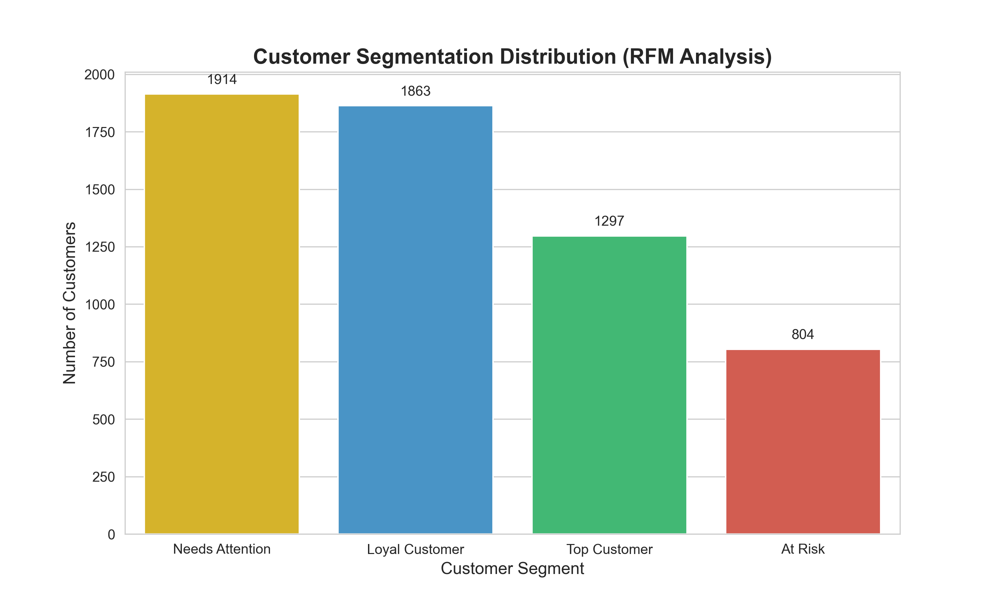

  
  <h1>RFM Customer Segmentation Analysis</h1>
  
  

    <b>Transforming transactional data into actionable business strategies using SQL & Python.</b>
  

  

    
    
    
    
    
  

   

  

<h2>📌 Project Overview</h2>

  This project analyzes customer behavior using the <b>RFM (Recency, Frequency, Monetary)</b> technique on the "Online Retail II" dataset. By simulating a real-world data pipeline, I bridged <b>SQL</b> for efficient data extraction and <b>Python</b> for advanced statistical scoring.

<h3>🔍 Key Features</h3>
<ul>
  <li><b>Hybrid Pipeline:</b> SQL for heavy aggregations + Python for analytics.</li>
  <li><b>Vectorized Scoring:</b> Utilizing <code>NumPy</code> and <code>Pandas</code> for high-performance calculations.</li>
  <li><b>Actionable Insights:</b> Classifying customers into 4 distinct segments for marketing targeting.</li>
</ul>

<h2>📊 Analysis Results</h2>

Below is a snapshot of the segmentation logic applied to the dataset:

<table align="center">
  <thead>
    <tr>
      <th>Segment</th>
      <th>Description</th>
      <th>Actionable Strategy</th>
    </tr>
  </thead>
  <tbody>
    <tr>
      <td>🌟 <b>Top Customer</b></td>
      <td>High spending, frequent visits, recent activity.</td>
      <td>Provide VIP offers & loyalty programs.</td>
    </tr>
    <tr>
      <td>💎 <b>Loyal Customer</b></td>
      <td>Good frequency and monetary value.</td>
      <td>Upsell new products & encourage reviews.</td>
    </tr>
    <tr>
      <td>⚠️ <b>Needs Attention</b></td>
      <td>Recent purchase but low frequency.</td>
      <td>Send discount codes to increase engagement.</td>
    </tr>
    <tr>
      <td>📉 <b>At Risk</b></td>
      <td>High value in past, but hasn't visited recently.</td>
      <td>Win-back campaigns immediately.</td>
    </tr>
  </tbody>
</table>

<h2>🛠 How to Run</h2>

Follow these steps to reproduce the analysis:

<pre>
<code>
# 1. Clone the repository
git clone https://github.com/SeyyedSajjadFazeli/RFM-Customer-Segmentation.git

# 2. Install dependencies
pip install pandas numpy matplotlib seaborn

# 3. Run the analysis script
python analysis.py

# 4. Generate visualizations
python visualize.py
</code>
</pre>

  
<i>Developed by Seyyed Sajjad Fazeli - Data Analysis Engineer</i>

  

    
  

